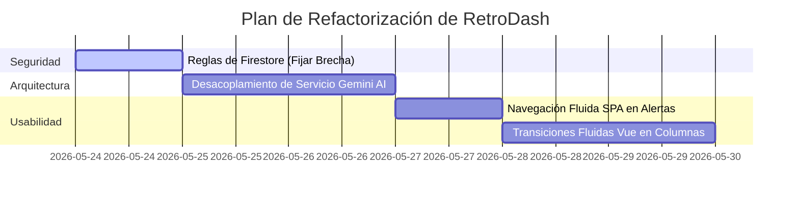

# Análisis de Arquitectura y Código: RetroDash (Calidad Internacional)

Hola, **Martin**. De acuerdo con tu solicitud, he realizado un análisis exhaustivo y riguroso de todo el proyecto **RetroDash** (Vue 3, Vite, Pinia, Firebase, Gemini AI). 

Como experto frontend y arquitecto de software, he evaluado la estructura del proyecto bajo estándares de calidad mundial, analizando su arquitectura, patrones de diseño, seguridad y rendimiento.

A continuación te presento los diagramas arquitectónicos y los listados con total sinceridad, franqueza y sin complacencias.

---

## 1. Diagrama de la Arquitectura del Sistema

El siguiente diagrama detalla cómo fluyen los datos y cómo interactúan los componentes reactivos de RetroDash en tiempo real:

```mermaid
graph TD
    subgraph Frontend_Vue_SPA["Frontend (Vue 3 SPA)"]
        Router["Vue Router (Navegación SPA)"]
        AuthStore["Pinia Auth Store"]
        BoardStore["Pinia Board Store (Real-time Sync)"]
        
        Dashboard["DashboardView.vue"]
        RetroBoard["RetroBoardView.vue"]
        
        BoardCard["BoardCard.vue (Premium UI)"]
        RetroCard["RetroCard.vue (Peer Bias Shield)"]
        AiActionables["AiActionables.vue"]
    end

    subgraph Firebase_Backend["Firebase & Services"]
        FirebaseAuth["Firebase Auth (Google Login)"]
        Firestore["Cloud Firestore (Real-time DB)"]
        GeminiAPI["Gemini AI 2.5 Flash API"]
        BrowserNotify["Notification API (setTimeout)"]
    end

    %% Relaciones
    Dashboard --> Router
    RetroBoard --> Router
    Dashboard --> BoardCard
    RetroBoard --> RetroCard
    RetroBoard --> AiActionables
    
    AuthStore --> FirebaseAuth
    BoardStore --> Firestore
    RetroBoard --> GeminiAPI
    RetroBoard --> BrowserNotify
```



---

## 2. Cosas Bien Hechas (Puntos Fuertes) 🚀

El proyecto cuenta con bases sólidas que reflejan excelentes decisiones de diseño de software y frontend:

1. **Sincronización en Tiempo Real Impecable**: El uso de la suscripción reactiva a Firestore mediante `onSnapshot` tanto para el tablero (`subscribeToBoard`) como para las tarjetas (`subscribeToCards`) es idóneo para una herramienta colaborativa. Permite una sincronización bidireccional instantánea entre participantes.
2. **Estrategia "Peer Bias Shield" (Escudo contra Sesgos)**: La idea de enmascarar los comentarios de otros miembros con un candado durante la fase de `brainstorm` y revelarlos en la fase de `voting` es un acierto brillante a nivel de UX de metodologías Agile. Evita la influencia prematura entre compañeros.
3. **Gestión de Memoria y Ciclo de Vida Limpio**: En `RetroBoardView.vue`, la limpieza meticulosa de listeners en `onUnmounted` mediante `boardStore.unsubscribeAll()` y la detención de intervalos del temporizador previenen Memory Leaks severos, demostrando un excelente cuidado en el ciclo de vida de Vue.
4. **Experiencia Mobile-First con Gestos (Swipe)**: La implementación de manejadores táctiles (`touchStartX`, `touchStartY`) y cálculo dinámico de traslación CSS para navegar entre las columnas con un deslizamiento horizontal (Swiping) es sumamente usable y responsivo.
5. **Estilos Visuales Glassmorphism Elegantes**: La base de diseño implementada en `style.css` cuenta con una atmósfera premium muy pulida: fondos translúcidos, difuminados fluidos, degradados armoniosos y la inyección reciente de glows interactivos basados en el estado del tablero.

---

## 3. Cosas "En Debe" (Fallas Críticas y Áreas de Mejora) ⚠️

Aquí es donde debemos ser completamente directos y sinceros. El proyecto tiene varios puntos débiles que lo separan de una aplicación robusta de nivel mundial:

### 🔴 A. Seguridad Crítica en Firestore (Brecha de Datos)
* **El problema**: En `firestore.rules`, la regla para las tarjetas es alarmantemente permisiva:
  ```javascript
  match /cards/{cardId} {
    allow read, write: if isAuthenticated();
  }
  ```
  Esto permite que **cualquier** usuario autenticado en la plataforma pueda leer, crear, modificar o eliminar tarjetas de **cualquier** retrospectiva de la base de datos, incluso si no tiene acceso al tablero padre o no figura en los participantes.
* **La solución**: Las reglas para la subcolección `/cards` deben verificar si el usuario tiene permisos sobre el tablero superior consultando el documento padre mediante la función `get()`.

### 🟡 B. Fragilidad Extrema en Notificaciones (Notificaciones Efímeras)
* **El problema**: El servicio `notifications.js` gestiona la programación de alertas mediante un simple `setTimeout` en memoria del cliente. Si el usuario recarga la pestaña, cierra la app o su sistema operativo suspende la pestaña inactiva, la alerta **desaparece instantáneamente** para siempre.
* **La solución**: Para notificaciones confiables fuera del ciclo de vida activo del cliente, se requiere el registro de un **Service Worker** con la **Push API (FCM)** o alertar de manera explícita que la pestaña debe seguir abierta para recibir alertas locales.

### 🟡 C. Navegación Bruta en Notificaciones (Pérdida de Estado SPA)
* **El problema**: Al interactuar con la notificación programada, el manejador hace:
  ```javascript
  window.location.href = `/retro/${board.id}`;
  ```
  Esto fuerza una **recarga dura** (hard reload) de toda la aplicación, destruyendo el estado reactivo cargado en memoria (como Pinia) y demorando el tiempo de carga, en lugar de realizar una navegación instantánea y fluida de SPA.
* **La solución**: Utilizar una referencia de navegación reactiva o inyectar directamente la instancia del `router` de Vue para navegar fluidamente mediante `router.push()`.

### 🟡 D. Acoplamiento de Lógica de Negocio e Inteligencia Artificial en Vistas
* **El problema**: En `RetroBoardView.vue` (líneas 278-368), toda la llamada directa a la SDK de Gemini (`@google/generative-ai`), la configuración del Agile Coach de IA y la manipulación de strings del prompt están metidas directamente dentro del componente de vista. Esto viola el **Principio de Responsabilidad Única (SRP)**.
* **La solución**: Abstraer la lógica del modelo de lenguaje, la estructuración del prompt y las llamadas a la API en un servicio dedicado (`src/services/gemini.js`), dejando la vista libre de ruido y fácil de testear.

### 🟢 E. Transiciones Visuales Rígidas en la UI
* **El problema**: Cuando las tarjetas se revelan en la fase de votación, o se añaden y eliminan en las columnas, aparecen y desaparecen de golpe de forma rígida.
* **La solución**: Aprovechar el componente nativo `<TransitionGroup>` de Vue 3 con estilos de transición CSS elásticos para que las tarjetas se deslicen, entren y se acomoden suavemente cuando cambia su orden (por votos) o presencia.

---

## 4. Plan de Acción Recomendado (Siguiente Nivel)

Para transformar esta app en un producto world-class, te propongo abordar las refactorizaciones en este orden de prioridad:



---
> [!IMPORTANT]
> Este archivo de análisis ha sido creado en la raíz del proyecto en `project-analysis/analysis.md` para que sirva como documento de ingeniería persistente. Podemos proceder a solucionar cualquiera de estas brechas técnicas para elevar el nivel del proyecto de inmediato.
